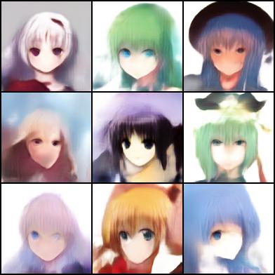
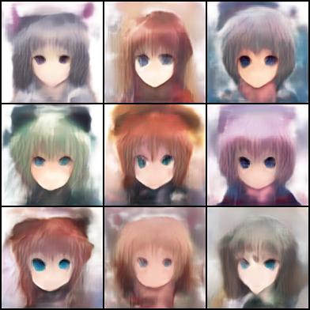
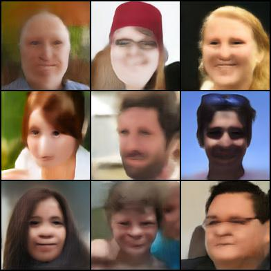
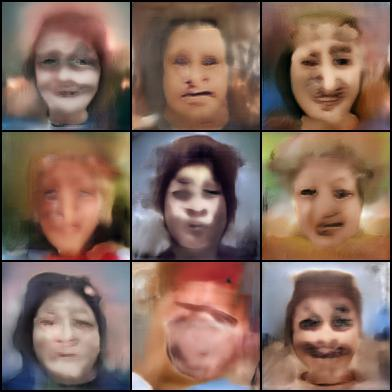

#  Small dataset image generation with PyTorch

pytorch re-implementation of Image Generation from Small Datasets via Batch Statistics Adaptation
- https://arxiv.org/abs/1904.01774
- https://github.com/nogu-atsu/small-dataset-image-generation

## Requirements
```
pytorch 1.0
python 3.6
```
see [`env.yml`](./env.yml) for the exact environment I used.

You will also need ImageNet pretrained 128 x 128 BigGAN weights from the BigGAN [author's repository](https://github.com/ajbrock/BigGAN-PyTorch). 

Download it from here: https://drive.google.com/open?id=1nAle7FCVFZdix2--ks0r5JBkFnKw8ctW
  
Unzip it, and put `G_ema.pth` to `./data/`

## training 
```
python train.py --dataset anime --gpu 0 --pretrained ./data/G_ema.pth
```

## Sample Reconstruction Results
### Anime Face
reconstruction   
   
random   
     
interpolation  
       


### Real Face
reconstruction   
   
random   
     
interpolation  
       

## Comments
I found it's important to tune hyper-parameters correctly. Basically there are five types of layers that are tuned. You can set learning rate for each of them individually.

- Linear layer to generate batch norm scale and bias in the original generator.
```
model.generator.blocks.0.0.bn1.gain.weight
model.generator.blocks.0.0.bn1.bias.weight
model.generator.blocks.0.0.bn2.gain.weight
model.generator.blocks.0.0.bn2.bias.weight
model.generator.blocks.1.0.bn1.gain.weight
model.generator.blocks.1.0.bn1.bias.weight
model.generator.blocks.1.0.bn2.gain.weight
model.generator.blocks.1.0.bn2.bias.weight
model.generator.blocks.2.0.bn1.gain.weight
model.generator.blocks.2.0.bn1.bias.weight
model.generator.blocks.2.0.bn2.gain.weight
model.generator.blocks.2.0.bn2.bias.weight
model.generator.blocks.3.0.bn1.gain.weight
model.generator.blocks.3.0.bn1.bias.weight
model.generator.blocks.3.0.bn2.gain.weight
model.generator.blocks.3.0.bn2.bias.weight
model.generator.blocks.4.0.bn1.gain.weight
model.generator.blocks.4.0.bn1.bias.weight
model.generator.blocks.4.0.bn2.gain.weight
model.generator.blocks.4.0.bn2.bias.weight
```
- Linear layer in the original generator. It's trained with very small learning rate. 
```
model.generator.linear.weight
model.generator.linear.bias
```
- Image Embeddings
```
model.embeddings.weight
```
- Statistic parameter for the original liner layer. This is newly introduced parameter by the paper. (See 4.1. Learnable parameters)
```
model.bsa_linear_scale
model.bsa_linear_bias
```
- Class conditional embeddings (with one classs). This is a replacement for [`generator.shared`](https://github.com/ajbrock/BigGAN-PyTorch/blob/ba3d05754120e9d3b68313ec7b0f9833fc5ee8bc/BigGAN.py#L82). 
```
model.linear.weight
```

## Dataset
I parepared random 50 images for face and anime. See `./data` directory. 
- face images are from [Flickr-Faces-HQ Dataset](https://github.com/NVlabs/ffhq-dataset)
- anime images are from [Danbooru-2017](https://www.gwern.net/Danbooru2018)

If you want to add your own dataset, check `dataloaders/setup_dataloader_smallgan.py` and add it.

## Disclaimer
I just check the results visually and don't check the evaluation scores (KMMD and Mean Variance). If you need complete reproduction, you should use [author's one](https://github.com/nogu-atsu/small-dataset-image-generation). Honestly, the visual quality looks worse than the originally reported ones. Anther difference is that this repository uses BigGAN for 128x128 but author uses BigGAN for 256x256 and SNGAN for 128x128. 

## Acknowledgement
I'd like to Thank [Atsuhiro Noguchi ](https://github.com/nogu-atsu/) for the help via personal email as well as the open sourced code, [Minjun Li](https://github.com/minjunli) for helpful discussion and anime dataset preparation. 
